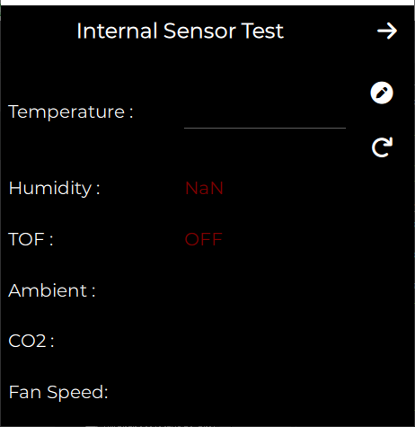

# STHERM

## Introduction

## Pre-requirements
Ensure you have the following software installed and configured before proceeding:
- CMake v3.16 or later
- Qt 6.4.3 with the following modules and libraries:
    - Qt 5 Compatiblity Module
    - Qt Shader Tools
    - Additional libraries
        - Qt Image Formats
        - Qt Multimedia
        - Qt Serial Port
        - Qt Virtual Keyboard
- Openssl v1.x

if you are using Windows:
- MSVC 2019 64-bit with the following workloads:
  - Desktop development with C++ workload

 > **_Note:_** If you're using Linux, make sure to run the app with `root` or `sudo` privileges.

## How to build?
1. Set CMake build type to Release
  - Qt Creator: </br>
    Navigate to `Projects` > `Edit build configuration` > `Release`
2. Generate makefiles:
  - Qt Creator: </br> 
    Navigate to `Build` > `Run CMake`
  - CMake: 
    ```properties
    cmake -S . -B ./build/release
    ```
3. Build project
  - Qt Creator: </br>
    Navigate to `Build` > `Build Project`
  - CMake: 
    ```properties
    cmake --build ./build/release --target ALL_BUILD --config Release
    ```

## How to Fake a Serial Number?
To enable fake serial mode, set `FAKE_UID_MODE` option to `ON` in your `CMakeLists` file and create a new fake serial ID. Please follow the steps below: </br>
Qt Creator: </br>

1. Go to `Projects` (Ctrl + 5).
2. Under the currently selected kit, click on `Build`.
3. In the `CMake Section`, select the `Current Configuration` tab.
4. Search for `FAKE_UID_MODE`.
5. Check the box to turn it ON.
6. Search for `FAKE_UID`
7. Set your fake Unique ID as the value
    > **_Note:_** Remember, the value must be 16 characters long and can include both digits and letters.
8. Search for `FAKE_SERIALID`
9. Set your fake serial ID as the value
    > **_Note:_** If you don't set the `FAKE_SERIALID`, the app will go through the first-run flow, and if the API responds, it will navigate to the home screen.
10. Finally, click on `Run CMake`.

CMake: </br>
```properties
cmake -DFAKE_UID_MODE:BOOL=ON -DFAKE_UID=$YOUR_FAKE_UID .
```

> **_Note:_** An active Internet connection is required to retrieve the serial number associated with your unique ID.

> **_WARNING:_** Ensure your fake serial number is not a valid serial number connected to a real device. Any changes you make in the app will appear on the device.

## Developer Mode
If you want to test the UI without needing a valid serial number or connecting to a device, you can set `userLevel` to `DEVELOPER` in `UiSession.qml`:
```QML
    // property int userLevel: UiSession.UserLevel.USER
    property int userLevel: UiSession.UserLevel.DEVELOPER
```
## Initial setup
> **_NOTE:_** This section is only for developers.

### What is initial setup exactly?
The initial setup flow involves configuring several settings for your device. These include:
- Selecting the system type, such as:
    - Traditional 
    - Heat Pump
    - Cool only
    - Heat Only
- Configuring the specific settings based on the selected system type.
- Specifying the accessories your device has.
You can select either a humidifier, dehumidifier, or none. Each accessory may have additional options.
- Setting the system run delay.
- Enabling technician access, which displays a QR code. By scanning the QR code, you can view information about the device after logging into your [nuvehvac.com](https://https://www.nuvehvac.com/#EN/USA/user/login/) account.

### How to Run Initial Setup Automatically
If your app has a valid serial number and the variable `hasClient` is set to `false`, the app will automatically run in initial setup mode.

### How to Run Initial Setup Manually

> **_NOTE_**: Make sure your app has a serial number. If you are testing the app on Windows, refer to the **How to Fake a Serial Number** section.

To run the app in initial setup mode, you need to set `INITIAL_SETUP_MODE` option to ON in your `CMakeLists` file. Please follow the steps below: </br>
Qt Creator: </br>

1. Go to `Projects` (Ctrl + 5).
2. Under the currently selected kit, click on `Build`.
3. In the `CMake Section`, select the `Current Configuration` tab.
4. Search for `INITIAL_SETUP_MODE`.
5. Check the box to turn it ON.
6. Finally, click on `Run CMake`.

CMake: </br>
```properties
cmake -DINITIAL_SETUP_MODE:BOOL=ON .
```

## Test mode
### What is Test mode exactly?
When you enable Test mode, you have the ability to physically test your device to ensure all components are functioning correctly. Additionally, Test mode allows you to manually update your device's software or firmware, providing greater control over maintenance and troubleshooting.


### How to move the app to the test mode?

You can enter test mode in several ways:

1. To run the app in test mode, set `TROUBLESHOOTING_MODE` option to ON in your `CMakeLists` file. Please follow the steps below: </br>
Qt Creator: </br>

    1. Go to `Projects` (Ctrl + 5).
    2. Under the currently selected kit, click on `Build`.
    3. In the `CMake Section`, select the `Current Configuration` tab.
    4. Search for `TROUBLESHOOTING_MODE`.
    5. Check the box to turn it ON.
    6. Finally, click on `Run CMake`.

    CMake: </br>
    ```properties
    cmake -DTROUBLESHOOTING_MODE:BOOL=ON .
    ```

Alternatively, if your device doesn't have GPIO or the `START_MODE_GPIO` is set to zero in the parameter definitions:

```C++
/** The GPIO used to determine start mode */
#define START_MODE_GPIO         0
```

2. To run the app in test mode, set `SERIAL_TEST_MODE` option to ON in your `CMakeLists` file. Please follow the steps below: </br>
Qt Creator: </br>

    1. Go to `Projects` (Ctrl + 5).
    2. Under the currently selected kit, click on `Build`.
    3. In the `CMake Section`, select the `Current Configuration` tab.
    4. Search for `SERIAL_TEST_MODE`.
    5. Check the box to turn it ON.
    6. Search for `SERIAL_TEST_DELAY_COUNTER`.
    7. Set your desired delay counter value.
    8. Finally, click on `Run CMake`.

    CMake: </br>
    ```properties
    cmake -DSERIAL_TEST_MODE:BOOL=ON -DSERIAL_TEST_DELAY_COUNTER=3 .
    ```

3. By pressing and holding the `device information` for 10 seconds in the device menu.

</br>
<center>

</center>
</br>

After enabling Test mode, you will see new buttons on the device information page that allow you to update the NRF, restart the app, or forget the device.

4. By pressing and holding the `system update` option for 10 seconds in the device menu.

</br>
<center>

</center>
</br>

After this, a new option for manual updates will appear on the system update page.


5. By tapping 10 times on the `FCC ID` in the device information page in the device menu.

</br>
<center>

</center>
</br>

After enabling Test mode through these methods, the app will show tests for touch functionality, color display, brightness, backlight, internal sensors, and relays. At the end, a QR code containing the serial number will be displayed, and then the device will restart.

</br>
<div style="display: flex; justify-content: space-around;">
  
  
  
</div>
</br>

</br>
<div style="display: flex; justify-content: space-around;">
  
  
  
</div>
</br>

</br>
<div style="display: flex; justify-content: space-around;">
  
  
</div>
</br>